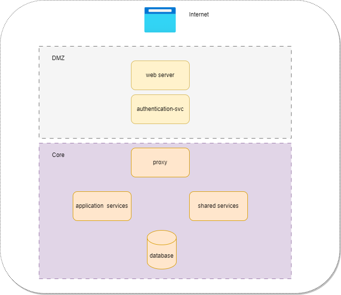

# About the Org
It contains some repos which are going to be used by all the applications within the org. Like
- some shared libraries for handling the security aspects of the applications
- few core services which need to be run first
- some shared services
- a document service for handling documents

and some application specific repos like
- lending-services for the LOS

and some other repos like
- Terraform scripts for GCP
- Open API specifications
- Config files for the config server

# Deployment Architecture
### The Components

# The mono repos
### security-libraries
Some shared libraries (jars) for handling the security across different microservices. Visit [the security-libraries](https://github.com/msrfintech/security-libraries) for more details.

### core-services
These are the core services which hanldes things like authentication, service discovery, config management, smart routing etc. Visti [core-services](https://github.com/msrfintech/core-services) for more details.

### shared-services
Some common services shared across different applications within the org. More details on [shared-services](https://github.com/msrfintech/shared-services)

### documents-service
The document managment solution for the org. More details on [documents-service](https://github.com/msrfintech/documents-service)

### lending-services
These constitute the LOS application. Click on [lending-services](https://github.com/msrfintech/lending-services) for more details

# Identity And Access Management
We are using the open source [Keycloak](https://www.keycloak.org) for Identity and Access Management. More details about it is on [this link](identityprovider.md)

# MongoDB
Some of the applications within the org use the MongoDB document database. More details about it is on [this link](mongodb.md)

# Terraform for GCP
You can use Teraform to deploy the entire project on Google Kubernetese Engine. Refer the [msr-terraform-repo](https://github.com/msrfintech/msr-terraform-repo) for more details.

